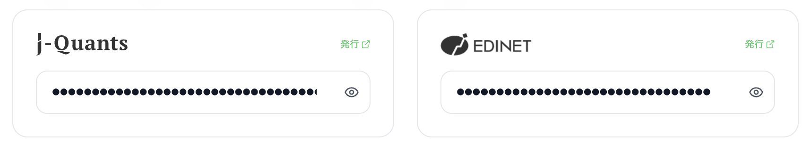
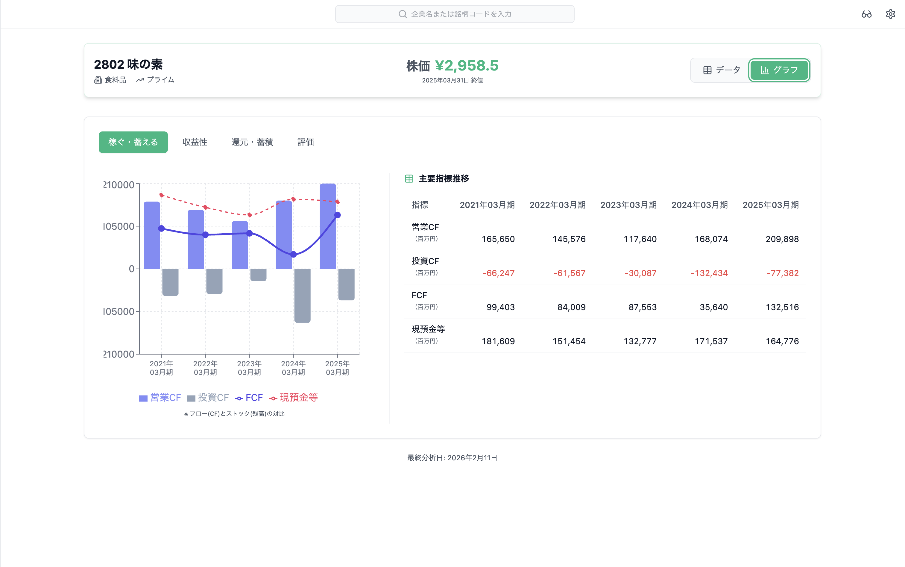
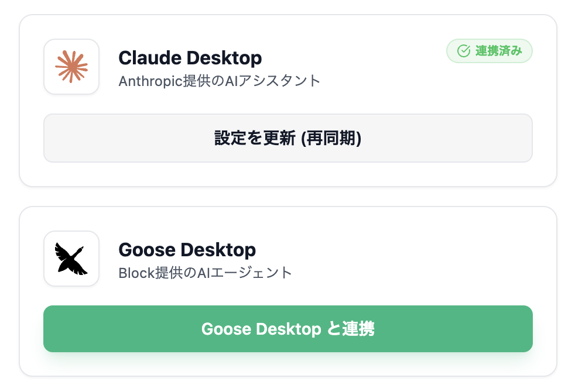
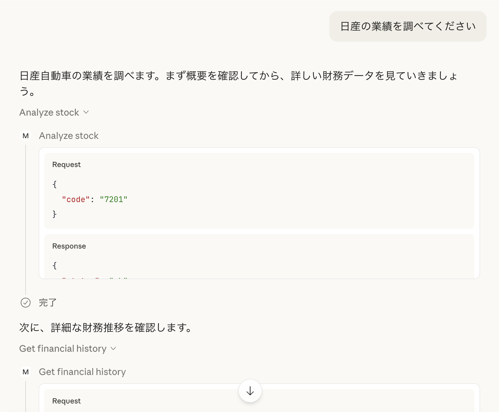
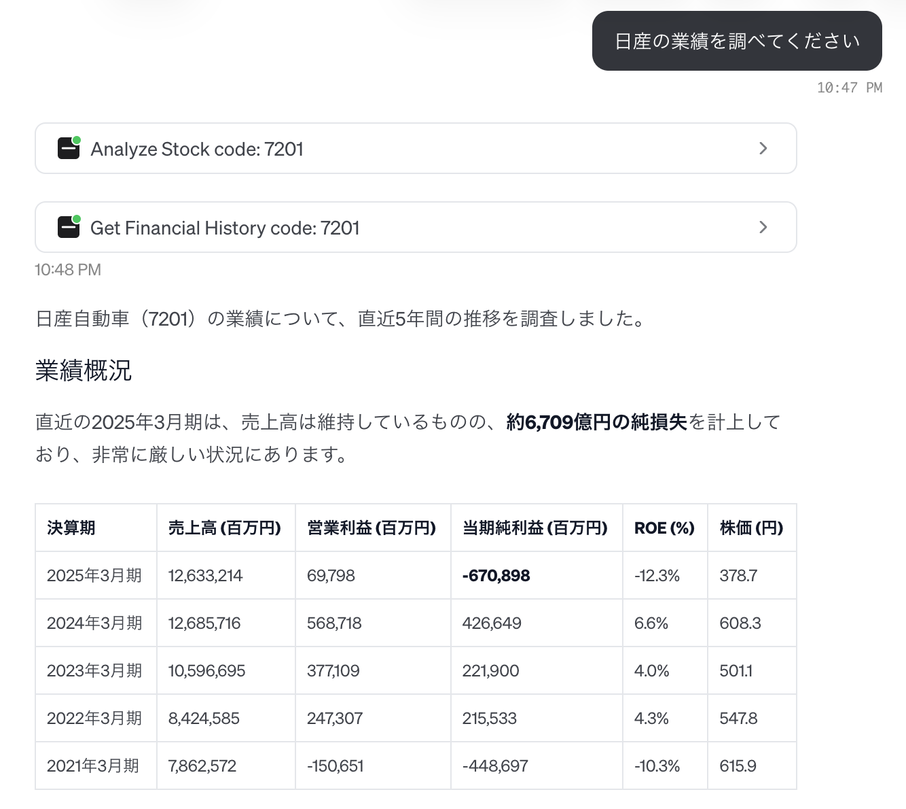

# クイックスタートガイド

## 一般ユーザー向け (macOS)

### インストール

1. [GitHub Releases](https://github.com/sollahiro/mebuki/releases)から最新版をダウンロード
   - **macOS**: `.dmg`ファイルをダウンロード

2. インストール
   - **macOS**: ダウンロードした`.dmg`ファイルを開き、mebukiアプリをアプリケーションフォルダにドラッグ

3. アプリを起動

アプリ起動後の設定と使い方については、[アプリの使い方](#アプリの使い方)セクションを参照してください。

---

## 開発者向けセットアップ

### 1. 依存パッケージのインストール

#### Node.js のインストール
Electron アプリケーションを動作させるには Node.js が必要です。

**macOS (Homebrew使用):**
```bash
brew install node
```

**インストール確認:**
```bash
node --version
npm --version
```

#### Python/Node.js パッケージのインストール
```bash
# Python 依存関係
pip install -r requirements.txt

# Node.js 依存関係
npm install
```

### 2. アプリの起動

#### 2.1. 起動スクリプトを使用(推奨)

```bash
./start.sh
```

このスクリプトは仮想環境の起動とアプリケーションの開始を自動的に行います。

#### 2.2. 手動で起動

```bash
# 1. 仮想環境をアクティベート
source venv/bin/activate

# 2. Electronアプリを起動
npm start
```

アプリ起動後の設定と使い方については、[アプリの使い方](#アプリの使い方)セクションを参照してください。

---

## アプリの使い方

### APIキーの設定

初回起動時は、設定画面(右上のギアアイコン)から以下のAPIキーを設定してください。

- **J-QUANTS API**: [登録・発行サイトへ](https://jpx-jquants.com/)
- **EDINET API**: [登録・発行サイトへ](https://disclosure2.edinet-fsa.go.jp/)



### J-Quants API プランについて

mebukiでは、J-Quants APIを通じて株価や財務データを取得します。プランによって取得可能なデータ期間やリクエスト制限が異なります。

| プラン | 月額(税込) | 財務データ期間 | レート制限 | 推奨度 |
| :--- | :--- | :--- | :--- | :--- |
| **Free** | 0円 | 過去2年間 | 5回/分 | 試用のみ |
| **Light** | 1,650円 | 過去5年間 | 60回/分 | **最低推奨** |
| **Standard** | 3,300円 | 過去10年間 | 120回/分 | 強力推奨 |
| **Premium** | 16,500円 | 全期間 | 500回/分 | プロフェッショナル |

> [!IMPORTANT]
> - **長期分析**: 投資判断には少なくとも3〜5年程度のトレンド確認が不可欠ですが、無料プランでは2年分しか取得できません。
> - **安定性**: 無料プランはレート制限が非常に厳しいため、バックエンドでの並列取得時に「レート制限エラー」が発生しやすくなります。
> - **快適さ**: 10年分の可視化機能をフルに活用するには、Standardプラン以上が最適です。

### 基本的な使い方

1. 企業名(例: 日立)もしくは銘柄コード(例: 6501)を入力
2. 企業名は入力に応じて検索候補が表示されます
3. 「分析」ボタンをクリック



詳細な使用方法は [README.md](../README.md#個別詳細分析) を参照してください。

---

## AIアシスタント連携(MCP)

mebukiは、Claude Desktop (Anthropic提供) や Goose Desktop (Block提供) などのAIアシスタントと連携して、対話形式で銘柄分析を行うことができます。

> [!IMPORTANT]
> MCP連携を利用するには、**mebukiアプリが起動している必要があります**。また、完全な機能を利用するには、APIキーを設定することを強く推奨します。APIキーが未設定の場合、ツール呼び出し時にエラーが返されます。

### MCP連携の設定

**前提条件:**
- mebukiアプリが起動していること
- Claude Desktop や Goose Desktop など、MCP対応のAIアシスタントがインストールされていること
- （推奨）J-QUANTS APIキーとEDINET APIキーが設定されていること

**設定手順:**

1. mebukiアプリを起動し、設定画面（右上のギアアイコン）を開きます
2. 「AIアシスタント連携」セクションで、連携したいAIアシスタント（Claude Desktop または Goose Desktop）の「連携」ボタンをクリックします



3. 連携が完了すると、成功メッセージが表示されます
4. **重要**: AIアシスタント（Claude Desktop または Goose Desktop）を再起動してください

### Claude Desktopでの使用例

連携後、Claude Desktopで以下のような質問ができます:

- 「トヨタの直近3年間の業績推移をまとめて」
- 「最新の有価証券報告書から、事業リスクについて要約して」
- 「この企業の資本効率(ROE)の推移はどうなっている?」



AIアシスタントがmebukiのツールを使用して、自動的に以下の情報を取得・分析します:

- 銘柄情報の検索
- 株価履歴データの取得
- 財務データの取得
- EDINET有価証券報告書の取得と分析

### Goose Desktopでの使用例

連携後、Goose Desktopでも同様に会話形式で分析が可能です:



### 利用可能なMCPツール

連携により、以下のツールがAIアシスタントから利用可能になります:

- `search_stock`: 企業名や銘柄コードから銘柄情報を検索
- `analyze_stock`: 指定した銘柄の基本情報を取得
- `get_financial_history`: 財務データの時系列推移を取得
- `get_raw_financial_summaries`: 有価証券報告書から財務サマリーを取得
- `get_edinet_documents`: EDINET文書の一覧を取得
- `get_edinet_document_content`: EDINET文書の内容を取得

## トラブルシューティング

### Node.jsが見つからない場合
```bash
brew install node
```

### Pythonの依存関係エラー
```bash
pip install -r requirements.txt
```

### Electronの依存関係エラー
```bash
# 各パッケージの node_modules を再構築
npm install
```

### APIキーエラー
```
❌ エラー: APIキーが設定されていません
```
**解決方法**:
- アプリ内の「設定」から API キーが正しく入力されているか確認

### モジュールが見つからないエラー
```
ModuleNotFoundError: No module named 'src'
```
**解決方法**:
- プロジェクトルートから実行しているか確認

### APIレート制限エラー
```
レート制限に達しました
```
**解決方法**:
- **プランの確認**: 無料プランには1日あたりのリクエスト数制限があり、また分あたりの制限も非常に厳しく設定されています。安定した利用には [Lightプラン以上](#j-quants-api-プランについて) への加入を推奨します。
- **キャッシュの利用**: 同じ銘柄の再検索時はキャッシュが利用されます。
- しばらく時間をおいてから再実行してください。

### MCP連携エラー
```
Failed to connect to mebuki backend
```
**解決方法**:
- mebukiアプリが起動しているか確認
- アプリが `http://localhost:8765` で動作しているか確認
- AIアシスタント（Claude Desktop や Goose Desktop）を再起動

### MCPツールでAPIキーエラーが発生する
**解決方法**:
- mebukiアプリの設定画面でAPIキーが正しく設定されているか確認
- APIキーを設定後、mebukiアプリを再起動

## 次のステップ

- [README.md](../README.md) で詳細な機能説明を確認
- [ARCHITECTURE.md](ARCHITECTURE.md) でシステム設計を確認
- 気になる銘柄を個別分析する