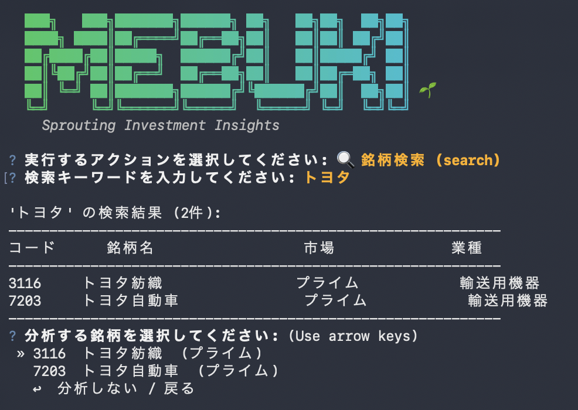

# mebuki 🍃

**「投資すべきでない銘柄」をAIと共に特定する、MCPネイティブな財務分析CLIツール**

mebukiは、J-QUANTS API、EDINET APIを最大限に活用し、投資判断における「負の側面」を浮き彫りにすることに特化した、**MCP (Model Context Protocol) 対応** の財務分析 Python CLI ツールです。

> [!CAUTION]
> **投資回避の判断をサポートするツールです**
> 本ツールは投資を推奨するものではありません。「投資すべきではない理由」を見つけるためのものです。投資は自己責任で行ってください。

---

## 🤖 AI アシスタントを「超一流の分析官」に

Claude Desktop や Goose などの MCP クライアントと連携し、自然言語で財務分析を実行。「トヨタの業績を調べて」といった会話形式で、最大10年分の詳細な財務データにアクセスできます。

## ✨ 主要機能

### 1. Model Context Protocol (MCP) 統合
- **あらゆる AI クライアントに対応**: Claude Desktop, Goose, VS Code (Cline/Roo Code) など、お好みの環境に mebuki の分析能力を統合。
- **フルスタック MCP 機能**: 銘柄検索、財務分析、マクロ分析、有報データ抽出など **全7ツール** を提供。AI がツールを組み合わせて分析を実行します。
- **ローカル完結型**: データ取得から分析指示まで、すべてユーザーのローカル環境で完結。

### 2. 高度な財務・市場分析 (CLI)
- **対話型モード**: `mebuki` コマンドだけで、銘柄検索や財務概要の確認が可能です。
- **定性情報の抽出**: 有価証券報告書の重要セクション（MD&A、事業リスク等）を即座に解析し、核心を抽出。

---

## 🚀 インストール & セットアップ

### 1. インストール

#### Homebrew

```bash
brew tap sollahiro/mebuki
brew install mebuki
```

### 2. API キーの設定
CLI の初期設定コマンドを実行します：

```bash
mebuki config init
```
以下のキーが必要です（J-QUANTS の Light プラン以上を推奨）：
- **J-QUANTS APIキー**: [公式サイト](https://jpx-jquants.com/)で取得
- **EDINET APIキー**: [公式サイト](https://disclosure2.edinet-fsa.go.jp/)で取得

### 3. AI アシスタントへの登録
Claude Desktop や Goose などの MCP クライアントへの自動登録が可能です：

```bash
# Claude Desktop の場合
mebuki mcp install-claude

# Goose の場合
mebuki mcp install-goose
```
実行後、各クライアントを再起動してください。

---

## 📂 使い方 (CLI)

対話モードでは、アクション選択 → キーワード入力 → 検索結果から銘柄選択まで、矢印キーでスムーズに操作できます。



### 銘柄を検索する
```bash
mebuki search トヨタ
```

### 財務データを分析する
```bash
mebuki analyze 7203 --years 5
```

### 対話モードを起動する
```bash
mebuki
```

---

## 🛠️ MCP ツール

AI アシスタントは以下のツールを自動的に使い分けます：

| カテゴリ | ツール名 | 用途 |
| :--- | :--- | :--- |
| **検索** | `find_japan_stock_code` | 社名やコードから証券コードを特定 |
| **定量分析** | `get_japan_stock_financial_data` | 財務データ（概況、10年推移、指標、生データ）を取得 |
| **株価** | `get_japan_stock_price_data` | 日足株価履歴データの取得 |
| **有報検索** | `search_japan_stock_filings` | EDINET文書（有報等）の検索 |
| **有報抽出** | `extract_japan_stock_filing_content` | 有報の特定セクション（事業リスク等）の抽出 |
| **マクロ** | `get_macro_economic_data` | マクロ指標（為替、金融政策）の取得 |
| **可視化** | `visualize_financial_data` | 財務データの可視化パネル表示（UI連携用） |

---

## ⚖️ 免責事項

本ソフトウェアおよび提供される情報は、投資判断の参考として提供されるものであり、投資の勧誘を目的としたものではありません。最終的な投資判断は、必ず利用者ご自身の責任において行ってください。

---
Developed with ❤️ by [sollahiro](https://github.com/sollahiro)
