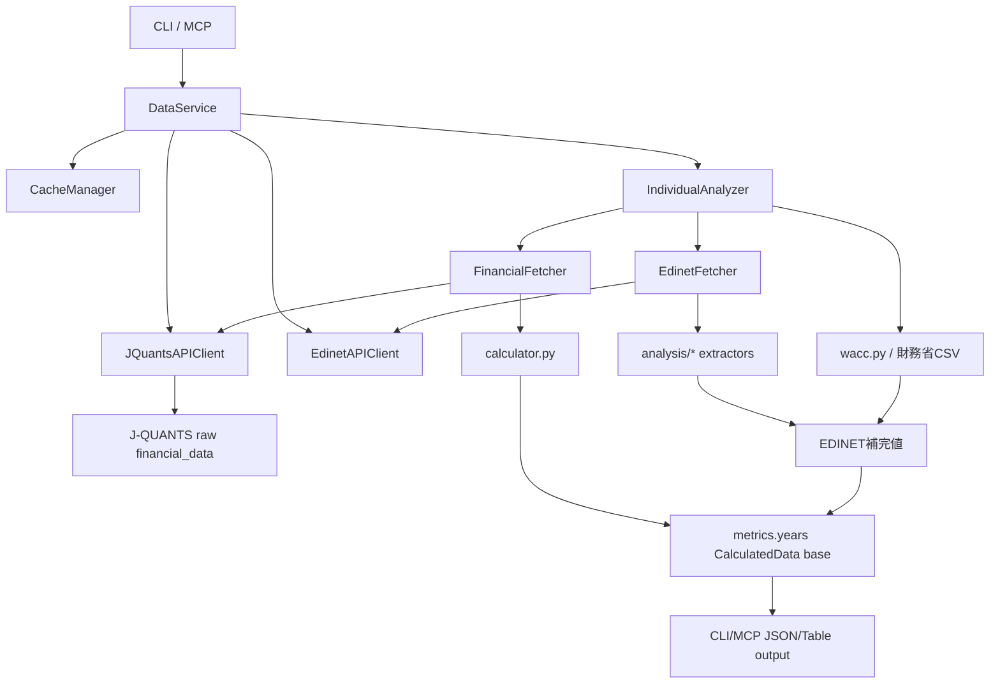

# アーキテクチャ棚卸しメモ

作成日: 2026-05-02

mebuki は J-QUANTS、EDINET、財務省CSV、ローカル銘柄マスタを組み合わせて財務指標を作る。機能追加のたびに取得項目と補完ロジックが積み上がってきたため、ここでは現状の流れ、指標の出所、キャッシュ構造、見直し候補を整理する。

## 1. 現状マップ

主要な責務は以下。

| レイヤー | 主なファイル | 現在の責務 |
|---|---|---|
| CLI/MCP | `mebuki/app/cli/*`, `mebuki/app/mcp_server.py` | 入力検証、出力形式、DataService呼び出し |
| 統合サービス | `services/data_service.py` | J-QUANTS/EDINETクライアント生成、キャッシュ、各サービス委譲 |
| 年次分析 | `services/analyzer.py` | J-QUANTS基礎指標、EDINET補完、WACCの統合 |
| J-QUANTS | `services/financial_fetcher.py`, `analysis/calculator.py` | 財務サマリー取得、年度抽出、基礎指標計算 |
| EDINET | `api/edinet_client.py`, `services/edinet_fetcher.py` | 書類検索、XBRL取得、抽出器実行 |
| XBRL抽出 | `analysis/*.py` | IBD、GP、IE、TAX、EMP、NR、OP、CF等の抽出 |
| 半期 | `services/half_year_data_service.py` | J-QUANTS H1/H2基礎値 + EDINET 2Q/FY補完 |
| 外部金利 | `utils/wacc.py` | 財務省10年国債利回りCSV取得、WACC計算 |

## 2. 取得元とキャッシュ

| データ | 取得元 | キャッシュ | 現状評価 |
|---|---|---|---|
| 銘柄基本情報 | J-QUANTS equity master / local master | 個別分析結果に含まれる | 実用上OK |
| 財務サマリー | J-QUANTS financial statements | `individual_analysis_{code}` / `half_year_periods_{code}_{years}` | 指標再計算まで含むキャッシュのため便利だが、補完ロジック更新時は古い結果が残る |
| EDINET日別検索 | EDINET `/documents.json?date=...` | `analysis_cache/edinet/search_YYYY-MM-DD.json` | TTL/メタデータなし。件数が増えやすい |
| EDINET XBRL | EDINET `/documents/{docID}?type=1` | `analysis_cache/edinet/{docID}_xbrl/` | 2回目以降は高速。容量が増えやすい |
| 財務省金利 | MOF `jgbcm_all.csv`, `jgbcm.csv` | `mof_rf_rates` 1日TTL | 方針は明確。個別分析キャッシュ内WACCは更新されない点に注意 |
| 決算予定 | J-QUANTS earnings calendar | `earnings_calendar_store`, `earnings_calendar_last_fetched` | 1日更新で整理されている |

### キャッシュ上の課題

- `CacheManager` 管理下のJSONと、EDINET配下の手動ファイルキャッシュが分かれている。
- EDINET検索キャッシュとXBRL展開ディレクトリにはバージョン、TTL、容量上限がない。
- `individual_analysis_*` は最終成果物を丸ごと保持するため、XBRL抽出器やWACCロジックを改善してもキャッシュヒット時は再計算されない。
- 廃止済み機能のキャッシュはコードから参照されなくなった後も残る。BOJは今回削除済み。

## 3. 指標カタログ

| 指標/項目 | 主な出所 | 単位 | 補完/計算 |
|---|---|---|---|
| `Sales` | J-QUANTS | 百万円 | IFRS金融会社で未取得ならEDINET `net_revenue` で補完し `SalesLabel="純収益"` |
| `OP` | J-QUANTS | 百万円 | 未取得ならEDINET営業利益/経常利益/事業利益で補完し `OPLabel` を付与 |
| `NP` | J-QUANTS | 百万円 | 基礎値 |
| `Eq` | J-QUANTS | 百万円 | 基礎値、ROE/ROIC/WACCに利用 |
| `CFO`, `CFI`, `CFC` | J-QUANTS | 百万円 | 半期ではH1をEDINET 2Q、H2をFY-H1で補完 |
| `GrossProfit` | EDINET XBRL/HTML | 百万円 | 直接タグ、売上高-売上原価、US-GAAP HTMLなどで補完 |
| `InterestBearingDebt` | EDINET XBRL/HTML | 百万円 | 直接タグ、構成要素積み上げ、IFRS集約タグ、US-GAAP HTML |
| `InterestExpense` | EDINET XBRL/HTML | 百万円 | WACCの負債コストに利用 |
| `PretaxIncome`, `IncomeTax`, `EffectiveTaxRate` | EDINET XBRL/HTML | 百万円/% | WACCの税効果に利用 |
| `Employees` | EDINET XBRL | 人 | 連結優先、個別フォールバック |
| `ROE` | J-QUANTS由来計算 | % | `NP / Eq` |
| `ROIC` | J-QUANTS + EDINET | % | `NP / (Eq + InterestBearingDebt)`。IBD補完後に再計算 |
| `CostOfEquity` | 財務省CSV + 定数 | % | `Rf + beta * MRP` |
| `CostOfDebt` | EDINET IE/IBD | % | `InterestExpense / InterestBearingDebt` |
| `WACC` | 上記統合 | % | Eq、IBD、IE、実効税率、Rfから計算 |
| `DocID` | EDINET | 文字列 | 指標の根拠書類 |

### 指標上の課題

- `CalculatedData` は段階的に拡張されるため、どの指標がどのステップで入るかを知らないと追いにくい。
- 単位はおおむね百万円/%だが、XBRL抽出器の戻り値は円、呼び出し側で百万円変換する。境界が暗黙。
- `CFC` と半期側の `FreeCF` のように、似た概念の名称が混在している。
- 出所/手法 (`GrossProfitMethod`, `IBDAccountingStandard`, `SalesLabel`, `OPLabel`) は一部のみ明示される。全指標で一貫していない。

## 4. EDINET/XBRLの現状

EDINETは現在、`EdinetFetcher` が「書類検索」「XBRL取得」「各抽出器の実行」「年度別集約」をまとめて担う。`ExtractorSpec` により年次抽出器の追加はしやすくなっている。

良い点:

- `predownload_and_parse()` でXBRLを一括ダウンロード/パースし、複数抽出器で `pre_parsed` を共有できる。
- `_get_annual_docs()` で同一 `code + max_years` の書類検索をインスタンス内集約している。
- 年次抽出器は `ExtractorSpec` に集約され、重複は以前より減っている。

課題:

- `EdinetAPIClient` が日別検索キャッシュとXBRLファイルキャッシュを直接扱うため、キャッシュ方針が分散している。
- `search_documents()` の `years` 引数は受け取るが内部では使っていない。呼び出し側との契約が曖昧。
- 年次分析と半期分析でEDINET補完の呼び方が別経路になっており、GP/IBDなどの再利用単位が揃っていない。
- 抽出器の戻り値スキーマがモジュールごとに緩く、型で保証されていない。

## 5. CLI/MCPの対応

MCPとCLIは大枠では対応している。

| 機能 | CLI | MCP | メモ |
|---|---|---|---|
| 銘柄検索 | `search` | `find_japan_stock_code` | 対応 |
| 財務分析 | `analyze` | `get_japan_stock_financial_data` | 対応 |
| 半期 | `analyze --half` | `half: true` | 対応 |
| EDINET一覧 | `filings` | `search_japan_stock_filings` | 対応 |
| EDINET本文 | `filing` | `extract_japan_stock_filing_content` | 対応 |
| セクター | `sector` | `search_japan_stocks_by_sector` | 対応 |
| watch/portfolio | `watch`, `portfolio` | 対応ツール | 対応 |
| キャッシュ管理 | `cache prune` | なし | MCP対応原則上、必要なら追加検討 |

課題:

- `cache prune` はCLIに追加済みだが、MCPには未追加。ユーザーがMCPから運用するなら対応が必要。
- JSON出力時にバナーが混ざる問題は今回 `main.py` で抑制した。
- CLIとMCPの出力はどちらも内部dictをほぼそのまま返すため、公開スキーマとしては固定されていない。

## 6. 改善候補

### すぐやる価値が高い

1. `cache stats` を追加する  
   カテゴリ別件数・容量・最古/最新mtimeを表示する。運用上の判断がしやすくなる。

2. EDINET検索キャッシュにTTL方針を入れる  
   空結果は短め、ヒットありは長めなど。現状の `cache prune` は手動整理なので、取得時にも自然に古いものを無視できるとよい。

3. `CalculatedData` の出所メタデータを整える  
   例: `sources: {"GrossProfit": {"source": "edinet", "docID": "...", "method": "direct"}}` のような形を検討する。

4. `CFC` / `FreeCF` の命名整理  
   年次と半期で同じ概念なら統一、違うならドキュメントに明示する。

### 設計してから進める

1. EDINETキャッシュを正式なキャッシュ層に昇格する  
   `EdinetAPIClient` からファイル管理を分離し、TTL、容量上限、LRU、stats/pruneを同じ場所で扱う。

2. XBRL抽出器の戻り値TypedDict化  
   `current`, `prior`, `method`, `docID`, `components` などをモジュールごとに型定義する。`dict[str, Any]` を減らす。

3. 年次/半期のEDINET補完ロジック統合  
   同じdoc検索、download、pre_parse、extractを共有し、半期だけ別処理になっている部分を小さくする。

4. 個別分析キャッシュの粒度見直し  
   現在は最終成果物キャッシュ。J-QUANTS raw、EDINET doc map、XBRL parse result、最終metricsを分けると、ロジック更新時の再計算がしやすい。

### 今は触らないほうがよい

1. XBRLタグ候補の大規模整理  
   企業別・会計基準別の知見が詰まっている。テスト追加なしで動かすと壊れやすい。

2. EDINET検索ロジックの探索ウィンドウ短縮  
   97日+127日フォールバックは遅く見えるが、提出遅延や半期/四半期差異を拾う安全側の設計。実データを見てから調整する。

3. `CalculatedData` の公開キー削除  
   MCP/CLI利用者への互換性影響が大きい。renameよりalias期間を置くべき。

## 7. 推奨ロードマップ

### Phase 1: 可視化と運用整理

- `cache stats` 追加
- `cache prune` のMCP対応要否を判断
- docsにキャッシュ方針を明記
- 廃止済み機能のキャッシュ/設定を定期検出するチェックを追加

### Phase 2: 指標の出所整理

- 指標ごとの source/method/docID を統一的に持つ
- `CalculatedData` の命名・単位表をREADMEまたはdocsに反映
- `CFC` / `FreeCF` を整理

### Phase 3: EDINET境界の再設計

- `EdinetCacheStore` のような専用層を作る
- 日別検索、XBRL zip/展開、pre_parsed結果の責務を分ける
- 年次/半期の補完パイプラインを共通化

### Phase 4: 型とテストの強化

- XBRL抽出器戻り値のTypedDict化
- 実企業サンプルを使った回帰テストを増やす
- 会計基準別のゴールデンケースを整理する

## 8. 判断メモ

現状は「実用上は動くが、キャッシュと出所情報が追いにくくなり始めている」段階。直ちに全面改修するより、まず可視化とキャッシュ境界の整備を進めるのが安全。

特にEDINET/XBRLは価値の源泉なので、抽出ロジック自体を触る前に、キャッシュ、戻り値型、出所メタデータ、テストを先に固めるのがよい。
