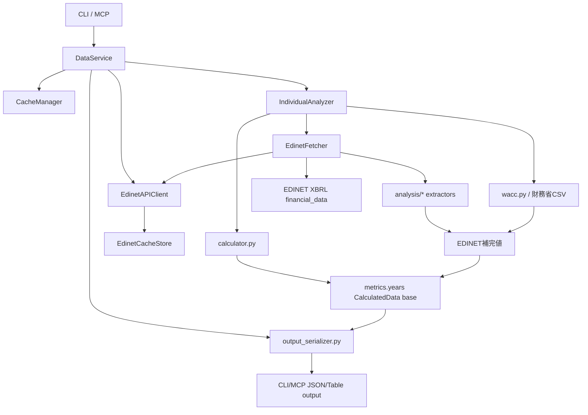

# アーキテクチャ棚卸しメモ

作成日: 2026-05-02
最終更新: 2026-05-06

mebuki は EDINET、財務省CSV、ローカル銘柄マスタを組み合わせて財務指標を作る。機能追加のたびに取得項目と補完ロジックが積み上がってきたため、ここでは現状の流れ、指標の出所、キャッシュ構造、見直し候補を整理する。

課題ごとの対応状況は `docs/architecture-status.md` を参照。

## 1. 現状マップ



主要な責務は以下。

| レイヤー | 主なファイル | 現在の責務 |
|---|---|---|
| CLI/MCP | `mebuki/app/cli/*`, `mebuki/app/mcp_server.py` | 入力検証、出力形式、DataService呼び出し |
| 統合サービス | `services/data_service.py` | EDINETクライアント生成、キャッシュ、各サービス委譲 |
| 年次分析 | `services/analyzer.py` | EDINET基礎指標、XBRL補完、WACCの統合 |
| 基礎指標 | `analysis/calculator.py` | 年度抽出、基礎指標計算 |
| EDINET | `api/edinet_client.py`, `services/edinet_fetcher.py` | 書類検索、XBRL取得、抽出器実行 |
| EDINETキャッシュ | `api/edinet_cache_store.py` | 日別検索キャッシュ、XBRL zip展開ディレクトリ管理 |
| XBRL抽出 | `analysis/*.py` | IBD、GP、IE、TAX、EMP、NR、OP、CF等の抽出 |
| 半期 | `services/half_year_data_service.py` | EDINET 2Q/FY から H1/H2 基礎値と補完値を構築 |
| 出力整形 | `utils/output_serializer.py` | CLI/MCP標準JSONからデバッグフィールドを除外 |
| 外部金利 | `utils/wacc.py` | 財務省10年国債利回りCSV取得、WACC計算 |

## 2. 取得元とキャッシュ

| データ | 取得元 | キャッシュ | 現状評価 |
|---|---|---|---|
| 銘柄基本情報 | local master | 個別分析結果に含まれる | 実用上OK |
| 財務サマリー | EDINET XBRL/HTML | `analysis_cache/derived/analysis/individual_analysis_{code}.json` / `analysis_cache/derived/half_year/half_year_periods_{code}_{years}.json` | 指標再計算まで含むキャッシュのため便利だが、補完ロジック更新時は古い結果が残る |
| EDINET日別検索 | EDINET `/documents.json?date=...` | `analysis_cache/external/edinet/documents_by_date/search_YYYY-MM-DD.json` | `EdinetCacheStore` が管理。空結果1日、直近ヒット30日、過去日3650日のTTL |
| EDINET書類インデックス | EDINET `/documents.json?date=...` | `analysis_cache/external/edinet/document_indexes/doc_index_YYYY.json` | 年次レンジ検索用。`_cache_version` と `built_through` で有効性を確認 |
| EDINET XBRL | EDINET `/documents/{docID}?type=1` | `analysis_cache/external/edinet/xbrl/{docID}_xbrl/` | `EdinetCacheStore` が管理。2GB上限を超えるとmtime LRUで古い展開ディレクトリを削除 |
| 財務省金利 | MOF `jgbcm_all.csv`, `jgbcm.csv` | `analysis_cache/derived/mof/mof_rf_rates.json` 1日TTL | 個別分析キャッシュ内WACCは更新されない。最新金利を反映する場合は `--no-cache` / `use_cache=False` |

### キャッシュ上の課題

- `external/` は外部取得物、`derived/` は mebuki 生成物として責務を分ける。EDINETの日別検索、年次インデックス、XBRL展開は `EdinetCacheStore` が管理する。
- EDINET検索キャッシュはTTLを持ち、XBRL展開ディレクトリは容量上限とmtime LRU削除を持つ。
- EDINET書類リストとXBRL parse結果は `CacheManager` 経由でも独立キャッシュする。最終分析キャッシュのバージョンを上げても、再取得・再parseを抑えやすい。
- `individual_analysis_*` は最終成果物を保持するため、WACCなど取得時点の外部値を含む。最新値が必要な場合は `use_cache=False` / `--no-cache` で再計算する。

## 3. 指標カタログ

| 指標/項目 | 主な出所 | 単位 | 補完/計算 |
|---|---|---|---|
| `Sales` | EDINET XBRL/HTML | 百万円 | 売上高が未取得なら経常収益・純収益で補完し `SalesLabel` を付与 |
| `OP` | EDINET XBRL/HTML | 百万円 | 営業利益、事業利益、経常利益などから抽出し `OPLabel` を付与 |
| `NP` | EDINET XBRL/HTML | 百万円 | 基礎値 |
| `Eq` | EDINET XBRL/HTML | 百万円 | 基礎値、ROE/ROIC/WACCに利用 |
| `CFO`, `CFI`, `CFC` | EDINET XBRL/HTML | 百万円 | 半期ではH1を2Q、H2をFY-H1で算出 |
| `FreeCF` | 互換名 | 百万円 | 半期データでは `CFC` と同値。新規参照は `CFC` 推奨 |
| `GrossProfit` | EDINET XBRL/HTML | 百万円 | 直接タグ、売上高-売上原価、US-GAAP HTMLなどで補完 |
| `InterestBearingDebt` | EDINET XBRL/HTML | 百万円 | 直接タグ、構成要素積み上げ、IFRS集約タグ、US-GAAP HTML |
| `InterestExpense` | EDINET XBRL/HTML | 百万円 | WACCの負債コストに利用 |
| `PretaxIncome`, `IncomeTax`, `EffectiveTaxRate` | EDINET XBRL/HTML | 百万円/% | WACCの税効果に利用 |
| `Employees` | EDINET XBRL | 人 | 連結優先、個別フォールバック |
| `ROE` | EDINET由来計算 | % | `NP / Eq` |
| `ROIC` | EDINET由来計算 | % | `NP / (Eq + InterestBearingDebt)`。IBD補完後に再計算 |
| `CostOfEquity` | 財務省CSV + 定数 | % | `Rf + beta * MRP` |
| `CostOfDebt` | EDINET IE/IBD | % | `InterestExpense / InterestBearingDebt` |
| `WACC` | 上記統合 | % | Eq、IBD、IE、実効税率、Rfから計算 |
| `DocID` | EDINET | 文字列 | 指標の根拠書類 |
| `MetricSources` | mebuki内部メタデータ | object | 指標ごとの `source`, `method`, `docID`, `unit`, `label` を保持。標準JSONでは除外 |

### 指標上の課題

- `CalculatedData` は段階的に拡張されるため、どの指標がどのステップで入るかを知らないと追いにくい。
- 単位はおおむね百万円/%だが、XBRL抽出器の戻り値は円、呼び出し側で百万円変換する。境界が暗黙。
- `FreeCF` は半期データの互換名として残す。新規実装・表示は `CFC` を優先する。
- 出所/手法は `MetricSources` に集約する。`SalesLabel` / `OPLabel` は標準JSONにも残す意味情報、`GrossProfitMethod` / `IBDAccountingStandard` はデバッグフィールドとして扱う。

### 公開JSONの出力境界

内部の `CalculatedData` には計算追跡用のフィールドを残す。一方、CLI/MCPの標準JSONでは `utils/output_serializer.py` を通して以下を除外する。

- `MetricSources`
- `IBDComponents`
- `GrossProfitMethod`
- `IBDAccountingStandard`

`mebuki analyze --include-debug-fields` または MCP `include_debug_fields: true` を指定した場合だけ、上記を含む。`SalesLabel` / `OPLabel` は「売上高ではなく純収益」「営業利益ではなく事業利益/経常利益」といった意味情報なので、標準JSONにも残す。

### `MetricSources` の形

`CalculatedData.MetricSources` は指標名をキーにしたメタデータ辞書。

```json
{
  "GrossProfit": {
    "source": "edinet",
    "method": "direct",
    "docID": "S100...",
    "unit": "million_yen"
  },
  "ROIC": {
    "source": "derived",
    "method": "NP / (Eq + InterestBearingDebt)",
    "unit": "percent"
  }
}
```

主な `source`:

| source | 意味 |
|---|---|
| `edinet` | EDINET XBRL/HTML由来 |
| `external` | 外部由来の既存レコード |
| `mof` | 財務省CSV由来 |
| `derived` | mebuki内部計算 |

主な `unit`:

| unit | 意味 |
|---|---|
| `million_yen` | 百万円 |
| `percent` | % |
| `yen` | 円 |
| `persons` | 人 |
| `ratio` | 比率 |
| `id` | 識別子 |

## 4. EDINET/XBRLの現状

EDINETは現在、`EdinetFetcher` が「対象書類の選定」「各抽出器の実行」「年度別集約」を担う。API通信とファイルキャッシュ境界は `EdinetAPIClient` / `EdinetCacheStore` に分離済み。`ExtractorSpec` により年次抽出器の追加はしやすくなっている。

現在の構成:

- `predownload_and_parse()` でXBRLを一括ダウンロード/パースし、複数抽出器で `pre_parsed` を共有できる。
- `_get_annual_docs()` / `_get_half_year_docs()` で書類検索を同じキャッシュ機構に乗せている。
- `_download_and_parse_docs()` で年次・半期のダウンロードとparse共有を集約している。
- 年次抽出器は `ExtractorSpec` に集約され、新しい抽出器を足すときの変更箇所を抑えている。
- 抽出器の戻り値は `utils/xbrl_result_types.py` の `TypedDict` で型付けしている。
- EDINET日別検索、年次インデックス、XBRL展開は `EdinetCacheStore` がTTL、バージョン、容量上限を管理する。

## 5. CLI/MCPの対応

MCPとCLIは大枠では対応している。

| 機能 | CLI | MCP | メモ |
|---|---|---|---|
| 銘柄検索 | `search` | `find_japan_stock_code` | 対応 |
| 財務分析 | `analyze` | `get_japan_stock_financial_data` | 対応 |
| 半期 | `analyze --half` | `half: true` | 対応 |
| デバッグフィールド | `analyze --include-debug-fields` | `include_debug_fields: true` | 対応 |
| EDINET一覧 | `filings` | `search_japan_stock_filings` | 対応 |
| EDINET本文 | `filing` | `extract_japan_stock_filing_content` | 対応 |
| セクター | `sector` | `search_japan_stocks_by_sector` | 対応 |
| watch/portfolio | `watch`, `portfolio` | 対応ツール | 対応 |
| キャッシュ可視化 | `cache status` | `get_japan_stock_cache_stats` | 読み取りのみ対応 |
| キャッシュ削除 | `cache clean` | なし | 安全のためCLIのみ |

運用方針:

- `cache clean` はCLIに限定する。MCPでは削除せず、`get_japan_stock_cache_stats` で容量とaudit結果だけ見せる。
- CLIとMCPの標準分析JSONは serializer 経由でデバッグフィールドを除外する。
- 公開JSONのキー集合は `tests/test_output_serializer.py` のゴールデンテストで固定する。

## 6. キャッシュ運用方針

キャッシュは「取得を速くするもの」と「分析結果を再利用するもの」が混在するため、まず可視化と安全な削除導線を優先する。

| コマンド/ツール | 目的 | 削除有無 |
|---|---|---|
| `mebuki cache status` | EDINET年次インデックスの準備状況、XBRL/分析キャッシュ容量、次の推奨アクションを確認 | なし |
| `mebuki cache warmup` | 不足しているEDINET年次インデックスを事前準備 | キャッシュ優先 |
| `mebuki cache refresh` | EDINET年次インデックスを今日まで明示更新 | APIキーが必要 |
| `mebuki cache clean` | 指定日数以上古いEDINET検索/XBRL展開などを削除 | dry-runがデフォルト。`--execute` 時のみ削除 |
| MCP `get_japan_stock_cache_stats` | MCP利用中にキャッシュ状態を確認 | なし |

削除方針:

- 財務省金利キャッシュ `mof_rf_rates` は現行機能なので削除対象にしない。WACCを最新金利で再計算したい場合は、分析結果キャッシュを避けるため `--no-cache` を使う。
- EDINET検索キャッシュとXBRL展開ディレクトリは、ユーザーが日数を指定したときだけ削除する。
- EDINET XBRL展開ディレクトリは保存時にも容量上限を確認し、上限を超えた場合は古いものから自動削除する。
- MCPからの削除操作は当面提供しない。削除が必要な場合はCLIでdry-runを確認してから `--execute` する。

## 7. 改善候補

### すぐやる価値が高い

1. 実企業サンプルの回帰テストを増やす
   XBRL抽出器の単体テストは厚い。次はJ-GAAP、IFRS、US-GAAPの代表銘柄で、年次・半期・公開JSONの一連の形を固定するとよい。

### 設計してから進める

1. `CacheManager` とEDINETキャッシュの統計・削除ポリシーをどこまで統合するか
   取得系ファイルキャッシュと分析結果JSONは性質が違う。無理に単一抽象へ寄せるより、CLI表示と削除導線の一貫性を優先する。

2. 個別分析キャッシュの粒度をさらに細かくするか
   書類リストとXBRL parse結果は独立キャッシュ済み。最終metricsの年度別キャッシュは複雑度に対する効果を見て判断する。

### 今は触らないほうがよい

1. XBRLタグ候補の大規模整理  
   企業別・会計基準別の知見が詰まっている。テスト追加なしで動かすと壊れやすい。

2. EDINET検索ロジックの探索ウィンドウ短縮  
   97日+127日フォールバックは遅く見えるが、提出遅延や半期/四半期差異を拾う安全側の設計。実データを見てから調整する。

3. `CalculatedData` の公開キー削除  
   MCP/CLI利用者への互換性影響が大きい。renameよりalias期間を置くべき。

## 8. 推奨ロードマップ

### Phase 1: 可視化と運用整理

- `cache status` 追加済み
- `cache warmup` / `cache refresh` 追加済み
- `cache clean` はMCP非対応、読み取りstatsのみMCP対応
- docsにキャッシュ方針を明記済み

### Phase 2: 指標の出所整理

- 指標ごとの source/method/docID/unit/label を `MetricSources` に追加済み
- CLI/MCP標準JSONでは `MetricSources` / `IBDComponents` / `GrossProfitMethod` / `IBDAccountingStandard` を除外済み
- `--include-debug-fields` / `include_debug_fields` でデバッグフィールドを明示的に出力可能
- `CalculatedData` の命名・単位表をdocsに反映済み
- 半期 `CFC` を追加し、`FreeCF` は互換名として整理済み

### Phase 3: EDINET境界の再設計

- `EdinetCacheStore` を追加し、日別検索キャッシュとXBRL zip展開を `EdinetAPIClient` から分離済み
- EDINET検索キャッシュのTTL、年次インデックスのバージョン、XBRL展開の容量上限・LRU削除を実装済み
- EDINET書類リストとXBRL parse結果を `CacheManager` 経由で独立キャッシュ済み
- 年次/半期の書類検索、ダウンロード、pre_parse共有を共通化済み

### Phase 4: 型とテストの強化

- XBRL抽出器戻り値のTypedDict化済み
- PyrightはCIに組み込み済み
- 実企業サンプルを使った回帰テストを増やす
- 会計基準別のゴールデンケースを整理する

## 9. 判断メモ

現状は、EDINET/XBRLを中心に財務指標を構築し、出所情報・公開JSON境界・キャッシュ境界を分けて運用する構成になっている。次に大きく効くのは、実企業サンプルによる回帰テストと、キャッシュ可視化の粒度改善。

特にEDINET/XBRLは価値の源泉なので、抽出ロジック自体を触る前に、キャッシュ、戻り値型、出所メタデータ、テストを先に固めるのがよい。
