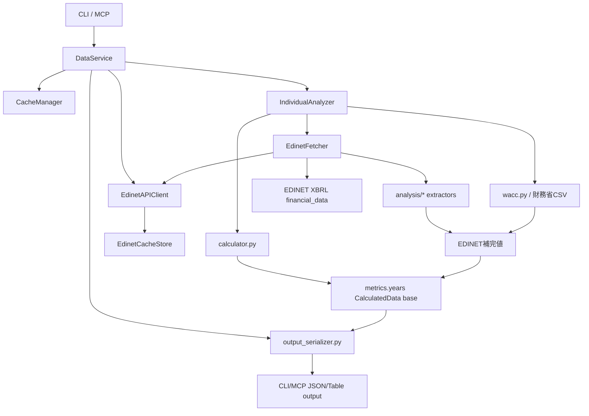

# アーキテクチャ棚卸しメモ

作成日: 2026-05-02
最終更新: 2026-05-02

mebuki は EDINET、財務省CSV、ローカル銘柄マスタを組み合わせて財務指標を作る。機能追加のたびに取得項目と補完ロジックが積み上がってきたため、ここでは現状の流れ、指標の出所、キャッシュ構造、見直し候補を整理する。

課題ごとの対応状況は `docs/architecture-status.md` を参照。

## 1. 現状マップ



主要な責務は以下。

| レイヤー | 主なファイル | 現在の責務 |
|---|---|---|
| CLI/MCP | `mebuki/app/cli/*`, `mebuki/app/mcp_server.py` | 入力検証、出力形式、DataService呼び出し |
| 統合サービス | `services/data_service.py` | EDINETクライアント生成、キャッシュ、各サービス委譲 |
| 年次分析 | `services/analyzer.py` | EDINET基礎指標、XBRL補完、WACCの統合 |
| 基礎指標 | `analysis/calculator.py` | 年度抽出、基礎指標計算 |
| EDINET | `api/edinet_client.py`, `services/edinet_fetcher.py` | 書類検索、XBRL取得、抽出器実行 |
| EDINETキャッシュ | `api/edinet_cache_store.py` | 日別検索キャッシュ、XBRL zip展開ディレクトリ管理 |
| XBRL抽出 | `analysis/*.py` | IBD、GP、IE、TAX、EMP、NR、OP、CF等の抽出 |
| 半期 | `services/half_year_data_service.py` | EDINET 2Q/FY から H1/H2 基礎値と補完値を構築 |
| 出力整形 | `utils/output_serializer.py` | CLI/MCP標準JSONからデバッグフィールドを除外 |
| 外部金利 | `utils/wacc.py` | 財務省10年国債利回りCSV取得、WACC計算 |

## 2. 取得元とキャッシュ

| データ | 取得元 | キャッシュ | 現状評価 |
|---|---|---|---|
| 銘柄基本情報 | local master | 個別分析結果に含まれる | 実用上OK |
| 財務サマリー | EDINET XBRL/HTML | `individual_analysis_{code}` / `half_year_periods_{code}_{years}` | 指標再計算まで含むキャッシュのため便利だが、補完ロジック更新時は古い結果が残る |
| EDINET日別検索 | EDINET `/documents.json?date=...` | `analysis_cache/edinet/search_YYYY-MM-DD.json` | `EdinetCacheStore` に分離済み。TTL/メタデータは未実装 |
| EDINET XBRL | EDINET `/documents/{docID}?type=1` | `analysis_cache/edinet/{docID}_xbrl/` | `EdinetCacheStore` に分離済み。2回目以降は高速。容量が増えやすい |
| 財務省金利 | MOF `jgbcm_all.csv`, `jgbcm.csv` | `mof_rf_rates` 1日TTL | 方針は明確。個別分析キャッシュ内WACCは更新されない点に注意 |

### キャッシュ上の課題

- `CacheManager` 管理下のJSONと、EDINET配下のファイルキャッシュはまだ別系統。ただしEDINET側は `EdinetCacheStore` に分離済み。
- EDINET検索キャッシュとXBRL展開ディレクトリにはバージョン、TTL、容量上限がない。
- `individual_analysis_*` は最終成果物を丸ごと保持するため、XBRL抽出器やWACCロジックを改善してもキャッシュヒット時は再計算されない。
- 廃止済み機能のキャッシュはコードから参照されなくなった後も残る。BOJは今回削除済み。

## 3. 指標カタログ

| 指標/項目 | 主な出所 | 単位 | 補完/計算 |
|---|---|---|---|
| `Sales` | EDINET XBRL/HTML | 百万円 | 売上高が未取得なら経常収益・純収益で補完し `SalesLabel` を付与 |
| `OP` | EDINET XBRL/HTML | 百万円 | 営業利益、事業利益、経常利益などから抽出し `OPLabel` を付与 |
| `NP` | EDINET XBRL/HTML | 百万円 | 基礎値 |
| `Eq` | EDINET XBRL/HTML | 百万円 | 基礎値、ROE/ROIC/WACCに利用 |
| `CFO`, `CFI`, `CFC` | EDINET XBRL/HTML | 百万円 | 半期ではH1を2Q、H2をFY-H1で算出 |
| `FreeCF` | 互換名 | 百万円 | 半期データでは `CFC` と同値。新規参照は `CFC` 推奨 |
| `GrossProfit` | EDINET XBRL/HTML | 百万円 | 直接タグ、売上高-売上原価、US-GAAP HTMLなどで補完 |
| `InterestBearingDebt` | EDINET XBRL/HTML | 百万円 | 直接タグ、構成要素積み上げ、IFRS集約タグ、US-GAAP HTML |
| `InterestExpense` | EDINET XBRL/HTML | 百万円 | WACCの負債コストに利用 |
| `PretaxIncome`, `IncomeTax`, `EffectiveTaxRate` | EDINET XBRL/HTML | 百万円/% | WACCの税効果に利用 |
| `Employees` | EDINET XBRL | 人 | 連結優先、個別フォールバック |
| `ROE` | EDINET由来計算 | % | `NP / Eq` |
| `ROIC` | EDINET由来計算 | % | `NP / (Eq + InterestBearingDebt)`。IBD補完後に再計算 |
| `CostOfEquity` | 財務省CSV + 定数 | % | `Rf + beta * MRP` |
| `CostOfDebt` | EDINET IE/IBD | % | `InterestExpense / InterestBearingDebt` |
| `WACC` | 上記統合 | % | Eq、IBD、IE、実効税率、Rfから計算 |
| `DocID` | EDINET | 文字列 | 指標の根拠書類 |
| `MetricSources` | mebuki内部メタデータ | object | 指標ごとの `source`, `method`, `docID`, `unit`, `label` を保持。標準JSONでは除外 |

### 指標上の課題

- `CalculatedData` は段階的に拡張されるため、どの指標がどのステップで入るかを知らないと追いにくい。
- 単位はおおむね百万円/%だが、XBRL抽出器の戻り値は円、呼び出し側で百万円変換する。境界が暗黙。
- `FreeCF` は半期データの互換名として残す。新規実装・表示は `CFC` を優先する。
- 出所/手法は `MetricSources` に集約する。`SalesLabel` / `OPLabel` は標準JSONにも残す意味情報、`GrossProfitMethod` / `IBDAccountingStandard` はデバッグフィールドとして扱う。

### 公開JSONの出力境界

内部の `CalculatedData` には計算追跡用のフィールドを残す。一方、CLI/MCPの標準JSONでは `utils/output_serializer.py` を通して以下を除外する。

- `MetricSources`
- `IBDComponents`
- `GrossProfitMethod`
- `IBDAccountingStandard`

`mebuki analyze --include-debug-fields` または MCP `include_debug_fields: true` を指定した場合だけ、上記を含む。`SalesLabel` / `OPLabel` は「売上高ではなく純収益」「営業利益ではなく事業利益/経常利益」といった意味情報なので、標準JSONにも残す。

### `MetricSources` の形

`CalculatedData.MetricSources` は指標名をキーにしたメタデータ辞書。

```json
{
  "GrossProfit": {
    "source": "edinet",
    "method": "direct",
    "docID": "S100...",
    "unit": "million_yen"
  },
  "ROIC": {
    "source": "derived",
    "method": "NP / (Eq + InterestBearingDebt)",
    "unit": "percent"
  }
}
```

主な `source`:

| source | 意味 |
|---|---|
| `edinet` | EDINET XBRL/HTML由来 |
| `external` | 外部由来の既存レコード |
| `mof` | 財務省CSV由来 |
| `derived` | mebuki内部計算 |

主な `unit`:

| unit | 意味 |
|---|---|
| `million_yen` | 百万円 |
| `percent` | % |
| `yen` | 円 |
| `persons` | 人 |
| `ratio` | 比率 |
| `id` | 識別子 |

## 4. EDINET/XBRLの現状

EDINETは現在、`EdinetFetcher` が「対象書類の選定」「各抽出器の実行」「年度別集約」を担う。API通信とファイルキャッシュ境界は `EdinetAPIClient` / `EdinetCacheStore` に分離済み。`ExtractorSpec` により年次抽出器の追加はしやすくなっている。

良い点:

- `predownload_and_parse()` でXBRLを一括ダウンロード/パースし、複数抽出器で `pre_parsed` を共有できる。
- `_get_annual_docs()` で同一 `code + max_years` の書類検索をインスタンス内集約している。
- 年次抽出器は `ExtractorSpec` に集約され、重複は以前より減っている。

課題:

- `EdinetCacheStore` は導入済みだが、TTL、容量上限、LRU、統一バージョン管理までは未実装。
- 年次分析と半期分析でEDINET補完の呼び方が別経路になっており、GP/IBDなどの再利用単位が揃っていない。
- 抽出器の戻り値スキーマがモジュールごとに緩く、型で保証されていない。

## 5. CLI/MCPの対応

MCPとCLIは大枠では対応している。

| 機能 | CLI | MCP | メモ |
|---|---|---|---|
| 銘柄検索 | `search` | `find_japan_stock_code` | 対応 |
| 財務分析 | `analyze` | `get_japan_stock_financial_data` | 対応 |
| 半期 | `analyze --half` | `half: true` | 対応 |
| デバッグフィールド | `analyze --include-debug-fields` | `include_debug_fields: true` | 対応 |
| EDINET一覧 | `filings` | `search_japan_stock_filings` | 対応 |
| EDINET本文 | `filing` | `extract_japan_stock_filing_content` | 対応 |
| セクター | `sector` | `search_japan_stocks_by_sector` | 対応 |
| watch/portfolio | `watch`, `portfolio` | 対応ツール | 対応 |
| キャッシュ可視化 | `cache stats`, `cache audit` | `get_japan_stock_cache_stats` | 読み取りのみ対応 |
| キャッシュ削除 | `cache prune` | なし | 安全のためCLIのみ |

課題:

- `cache prune` はCLIに限定する。MCPでは削除せず、`get_japan_stock_cache_stats` で容量とaudit結果だけ見せる。
- JSON出力時にバナーが混ざる問題は今回 `main.py` で抑制した。
- CLIとMCPの標準分析JSONは serializer 経由でデバッグフィールドを除外するようになった。ただし公開スキーマとして完全固定するには、出力契約テストとドキュメント化がまだ薄い。

## 6. キャッシュ運用方針

キャッシュは「取得を速くするもの」と「分析結果を再利用するもの」が混在するため、まず可視化と安全な削除導線を優先する。

| コマンド/ツール | 目的 | 削除有無 |
|---|---|---|
| `mebuki cache stats` | 全体容量、ファイル数、EDINET検索/XBRL件数、BOJ痕跡、不明JSON件数を確認 | なし |
| `mebuki cache audit` | 廃止済みBOJキャッシュ、metadata上のBOJキー、既知命名に合わないroot JSONを検出 | なし |
| `mebuki cache prune` | BOJ痕跡、指定日数以上古いEDINET検索/XBRL展開を削除 | dry-runがデフォルト。`--execute` 時のみ削除 |
| MCP `get_japan_stock_cache_stats` | MCP利用中にキャッシュ状態を確認 | なし |

削除方針:

- 廃止済みBOJキャッシュは `cache prune` の通常削除対象に含める。
- 財務省金利キャッシュ `mof_rf_rates` は現行機能なので削除対象にしない。
- EDINET検索キャッシュとXBRL展開ディレクトリは、ユーザーが日数を指定したときだけ削除する。
- MCPからの削除操作は当面提供しない。削除が必要な場合はCLIでdry-runを確認してから `--execute` する。

## 7. 改善候補

### すぐやる価値が高い

1. CLI/MCP標準JSONの契約テストを増やす  
   `MetricSources` などのデバッグフィールド除外は導入済み。年次・半期・キャッシュヒット・EDINET失敗経路で標準/デバッグ出力を検証する範囲を広げる。

2. EDINET検索キャッシュにTTL方針を入れる  
   空結果は短め、ヒットありは長めなど。現状の `cache prune` は手動整理なので、取得時にも自然に古いものを無視できるとよい。

3. `CalculatedData` の公開フィールド一覧を固定する  
   `MetricSources` は内部メタデータとして整理済み。次は標準JSONに残すキーとデバッグ専用キーをドキュメントとテストで固定する。

4. `CFC` / `FreeCF` の命名整理  
   半期にも `CFC` を追加済み。`FreeCF` は互換名として残す。

### 設計してから進める

1. EDINETキャッシュを正式なキャッシュ層に昇格する  
   `EdinetAPIClient` からファイル管理を分離し、TTL、容量上限、LRU、stats/pruneを同じ場所で扱う。

2. XBRL抽出器の戻り値TypedDict化  
   `current`, `prior`, `method`, `docID`, `components` などをモジュールごとに型定義する。`dict[str, Any]` を減らす。

3. Pyrightの運用範囲を決める
   dev依存には追加済み。全体を一気にstrict化せず、変更対象モジュール単位で型エラーを残さない運用にする。

4. 年次/半期のEDINET補完ロジック統合
   同じdoc検索、download、pre_parse、extractを共有し、半期だけ別処理になっている部分を小さくする。

5. 個別分析キャッシュの粒度見直し
   現在は最終成果物キャッシュ。EDINET doc map、XBRL parse result、最終metricsを分けると、ロジック更新時の再計算がしやすい。

### 今は触らないほうがよい

1. XBRLタグ候補の大規模整理  
   企業別・会計基準別の知見が詰まっている。テスト追加なしで動かすと壊れやすい。

2. EDINET検索ロジックの探索ウィンドウ短縮  
   97日+127日フォールバックは遅く見えるが、提出遅延や半期/四半期差異を拾う安全側の設計。実データを見てから調整する。

3. `CalculatedData` の公開キー削除  
   MCP/CLI利用者への互換性影響が大きい。renameよりalias期間を置くべき。

## 8. 推奨ロードマップ

### Phase 1: 可視化と運用整理

- `cache stats` 追加済み
- `cache audit` 追加済み
- `cache prune` はMCP非対応、読み取りstatsのみMCP対応
- docsにキャッシュ方針を明記済み
- 廃止済み機能のキャッシュ/設定検出をテスト追加済み

### Phase 2: 指標の出所整理

- 指標ごとの source/method/docID/unit/label を `MetricSources` に追加済み
- CLI/MCP標準JSONでは `MetricSources` / `IBDComponents` / `GrossProfitMethod` / `IBDAccountingStandard` を除外済み
- `--include-debug-fields` / `include_debug_fields` でデバッグフィールドを明示的に出力可能
- `CalculatedData` の命名・単位表をdocsに反映済み
- 半期 `CFC` を追加し、`FreeCF` は互換名として整理済み

### Phase 3: EDINET境界の再設計

- `EdinetCacheStore` を追加し、日別検索キャッシュとXBRL zip展開を `EdinetAPIClient` から分離済み
- 残: TTL、容量上限、LRU、統一バージョン管理は未対応
- 次: pre_parsed結果の責務を分ける
- 次: 年次/半期の補完パイプラインを共通化

### Phase 4: 型とテストの強化

- XBRL抽出器戻り値のTypedDict化
- Pyrightの運用範囲を決める。dev依存には追加済み
- 実企業サンプルを使った回帰テストを増やす
- 会計基準別のゴールデンケースを整理する

## 9. 判断メモ

現状は「実用上は動くが、キャッシュと出所情報が追いにくくなり始めている」段階。直ちに全面改修するより、まず可視化とキャッシュ境界の整備を進めるのが安全。

特にEDINET/XBRLは価値の源泉なので、抽出ロジック自体を触る前に、キャッシュ、戻り値型、出所メタデータ、テストを先に固めるのがよい。
