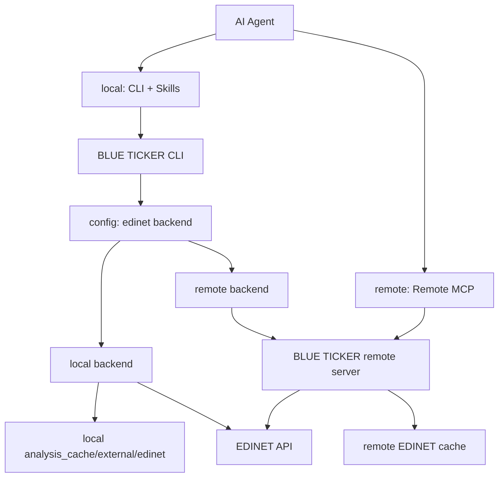

# リモートMCP移行とキャッシュ抽象化ロードマップ

作成日: 2026-05-06
最終更新: 2026-05-06

この文書は、将来的にローカルMCPを廃止し、リモートMCPへ移行するための設計ロードマップです。ローカルCLIとローカルキャッシュは廃止対象ではなく、CLI + Skills でAIエージェントがローカル操作する経路として残します。

## ゴール

- ローカルMCPは段階的に廃止する。
- ローカルCLIは継続し、AIエージェントは Skills 経由でCLIを操作できるようにする。
- EDINET APIとの直接通信は、将来的に外部サーバーへ移管できるようにする。
- CLIはローカルキャッシュとリモートキャッシュを設定で選べるようにする。
- 既存のローカルキャッシュ機能は正式な backend として残し、リモート backend と並行運用できるようにする。

## 非ゴール

- `ticker analyze` などの各サブコマンドに backend 選択オプションを増やさない。
- `CacheManager` とEDINET external cacheを無理に単一抽象へ統合しない。
- リモートMCP移行と同時に、既存のCLI出力契約やキャッシュ形式を大きく変えない。
- ローカルキャッシュを「レガシー」として扱わない。

## 将来構成



## Backend 方針

backend はCLIの個別サブコマンドではなく、設定で選択する。

| backend | 用途 | 認証 | EDINET API通信 | キャッシュ |
|---|---|---|---|---|
| `local` | 現行CLI互換。ローカル運用 | EDINET APIキー | CLIプロセスが直接実行 | ローカル `analysis_cache/external/edinet` |
| `remote` | リモートMCP/外部サーバー運用 | OAuthなどのremote server認証 | remote serverが実行 | サーバー上のremote cache |

初期値は `local` とする。`hybrid` は便利だが、データ鮮度や再現性が曖昧になりやすいため、最初のremote実装では見送る。必要になった場合は、remote優先・local fallbackなどの明確なポリシーを別途設計する。

設定イメージ:

```bash
ticker config set edinet-backend local
ticker config set edinet-key <EDINET_API_KEY>

ticker config set edinet-backend remote
ticker config login
```

## 現在地

EDINET external cache の抽象境界は追加済み。

| ファイル | 役割 |
|---|---|
| `blue_ticker/api/edinet_cache_backend.py` | `EdinetCacheBackend`。EDINET external cacheの差し替え境界 |
| `blue_ticker/api/edinet_cache_store.py` | `EdinetCacheBackend` のローカルファイル実装 |
| `blue_ticker/api/edinet_client.py` | 具象 `EdinetCacheStore` ではなく `EdinetCacheBackend` を受け取る |
| `tests/test_edinet_client.py` | メモリbackendを差し込み、抽象境界で動くことを確認 |

この段階では、ユーザー向け挙動は変えない。既存のローカルキャッシュとEDINET API直接通信はそのまま動作する。

## フェーズ計画

### Phase 1: 抽象化の定着

目的: ローカル実装を壊さず、リモート実装を差し込める境界を安定させる。

- `EdinetCacheBackend` をEDINET external cacheの正式境界として扱う。
- `EdinetCacheStore` はローカルbackend実装として残す。
- `EdinetAPIClient` からローカルファイルI/O前提を増やさない。
- 新しいEDINET external cache操作は、まず `EdinetCacheBackend` に必要性を確認してから追加する。
- `tests/test_edinet_client.py` でローカル以外のbackend差し込みを継続的に検証する。

完了条件:

- `poetry run pyright blue_ticker/` が通る。
- `poetry run pytest` が通る。
- ローカルCLIの既存挙動が変わらない。

### Phase 2: config設計

目的: backend選択と認証設定をCLI設定に導入する。

- `SettingsStore` に `edinetBackend` を追加する。初期値は `local`。
- 許可値はまず `local` / `remote` の2択にする。
- `local` では EDINET APIキーを使う。
- `remote` では EDINET APIキーではなく、remote server認証を使う。
- `config show` では backend と認証状態を明示する。
- `config init` は backend 選択に応じて、EDINET APIキー設定またはremote login導線を出す。

注意点:

- backend選択用のサブコマンドは追加しない。
- analyze/filings/filing/cacheなど各サブコマンドに `--edinet-backend` は追加しない。
- OAuthの具体実装前は、remote backendを選べても「未対応」と分かる戻り値にするか、設定保存のみ先行する。

### Phase 3: remote backend 最小実装

目的: CLIがEDINET APIへ直接アクセスせず、remote serverから同等のデータを取得できるようにする。

- `RemoteEdinetCacheBackend` を追加する。
- remote serverとの通信は標準ライブラリまたは既存依存で実装する。新規依存が必要な場合は事前確認する。
- remote backendは以下の操作を提供する。
  - 日別書類一覧の取得
  - 年次書類インデックスの取得
  - XBRL packageの取得
  - XBRLをローカル解析用ディレクトリへmaterializeする処理
- XBRL解析コードは当面 `Path` ベースを維持する。remoteから取得したXBRLも、CLI側の一時またはartifact cacheに展開して既存解析器へ渡す。

注意点:

- remote backendではCLIからEDINET APIキーを使わない。
- remote cacheのTTLや更新方針はサーバー側で管理する。
- CLI側にはremoteから取得したXBRL artifactの短期キャッシュだけを置く設計を優先する。

### Phase 4: remote MCP 導入

目的: MCP利用時のEDINET処理をremote server側へ寄せる。

- remote MCPはremote server上のキャッシュとEDINET取得機能を使う。
- CLI/MCPの公開機能とパラメーターは既存のCLI/MCPパリティ規約に合わせる。
- remote MCPは、ローカルの `analysis_cache` を直接操作しない。
- キャッシュ削除系は引き続き慎重に扱う。remote MCPから破壊的な削除操作を出す場合は、別途安全設計を行う。

完了条件:

- remote MCPで主要機能が動作する。
- CLIは `local` / `remote` backendを設定で選択できる。
- ローカルMCPなしでも、AIエージェントのローカル操作は CLI + Skills で成立する。

### Phase 5: ローカルMCP廃止

目的: MCPの運用経路をremoteへ寄せ、ローカルMCPの保守負荷を下げる。

- ローカルMCP機能を deprecated として告知する。
- CLI + Skills の利用導線をドキュメントで明確にする。
- remote MCPへの移行手順を用意する。
- 一定期間後にローカルMCPの起動・インストール導線を削除する。

削除対象の候補:

- `ticker mcp start`
- `ticker mcp install-*`
- ローカルMCPサーバー固有の設定・テスト

残すもの:

- BLUE TICKER CLI本体
- ローカル `EdinetCacheStore`
- `analysis_cache/derived` と `analysis_cache/external/edinet` のローカル運用
- SkillsからCLIを操作する運用

## 設計上の判断

### ローカルキャッシュは正式backendとして残す

ローカルキャッシュは、リモート移行後もCLI利用時の正式backendとする。EDINET APIキーをローカルに置き、CLIが直接EDINET APIへアクセスする使い方は残す。

### EDINET external cache と derived cache は分ける

EDINET external cacheは外部取得物、derived cacheはBLUE TICKER生成物であり、TTL、バージョン、削除ポリシーが異なる。したがって、現時点では `EdinetCacheBackend` と `CacheManager` を統合しない。

### XBRLはローカルPathへmaterializeする

既存のXBRL解析器はローカルディレクトリを読む。remote backendでも最終的にはローカルPathを返せるようにし、解析器側をremote awareにしない。

### backend選択はconfigで行う

サブコマンドごとに backend option を足すとCLIの表面積が増える。通常利用ではbackendは環境・認証に紐づくため、`config` に集約する。

## 未決事項

- remote serverのAPI設計
- OAuthフローとトークン保存場所
- remote cacheのTTL、更新、削除ポリシー
- remote backend利用時の `ticker cache status` 表示内容
- remote XBRL artifactをローカルにどれくらい保持するか
- local/remote間で分析結果キャッシュ `derived/` を共有するか、backendごとに分けるか

## 関連ドキュメント

- `docs/architecture-review.md`
- `docs/architecture-status.md`
- `.agents/rules/project/caching.md`
- `.agents/rules/project/mcp-cli-parity.md`
